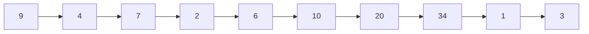
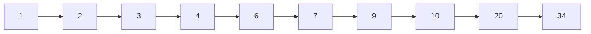

# Selection Sort: Brute Force approach
:+1: Simplest form of sorting by interating through the list multiple times until all the elements in the list are sorted.By scanning the array from left to right and keeping track of the minimum elements, the array is sorted.

# Psuedocode

:+1:  
 $\textcolor{olive}{Function\ sort\ (IntArray)}$  
 $\textcolor{violet}{for\ i\ in\ 0\ to\ n-1}$  
 $\textcolor{olive}{minValue\ =\ IntArray\ [i]}$  
 $\textcolor{olive}{minIndex\ =\ i}$  
 $\textcolor{violet}{for\ j\ in\ i+1\ to\ n-1}$  
 $\textcolor{olive}{if\ (IntArray[j]\ <\ minIndex)}$  
 $\textcolor{olive}{minValue\ =\ IntArray\ [j]}$  
 $\textcolor{olive}{minIndex\ =\ j}$  
 $\textcolor{olive}{Swap\ IntArray\ [i]\ ,\ IntArray\ [minIndex]}$  
 $\textcolor{olive}{return\ IntArray}$  
 
 # Visualization
 
 
Unsorted list of integers

Sorted list of integers after multiple scans

# Analyzing the algorithm
Algorithm runs through a sequence of n-iterations and in the ith iteration, algorithm now looks at the part of index i onwards to locate the smallest index and put it into the sorted region.
# Efficiency
OS dependent, hardware dependent and variations in some languages can affect efficiency. Focus should  then be on system independent factors. Hence defining the function of the size of the input would help in determining running time.
## Asymptotic Time Complexity
The algorithm execution passes through a number of iterations based on n times. So for the first cycle when i is = 0, n-1 times, then when i = 1, n-2 times etc. Hence the total number of comparisons of operations is the sum of the first n-1 numbers which comes down to:

S = 1+2+3+4+...n-1 
S = n-1 + n-2 + n-3 +.....1 
When we now add the equations, we arrive at 
2S = n + n + n....n
Therefore: n(n-1)/2 which comes down to **O(n2)**  
**O(n2)** because **n2**  is the dominant term and the constant factors are ignored as they are system dependent.

## Space Complexity
**O(1)**  
As no additional space is taken so it is constant.

